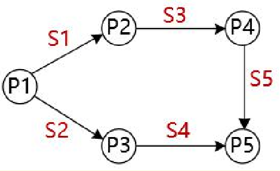

## 2016年上半年上午

- 90H即为二进制的: 10010000。说明此数为负数，其反码为: 10001111，其原码为:11110000，即-112，2X=-112，所以X=-56。

- 移位运算符就是在二进制的基础上对数字进行平移。
>按照平移的方向和填充数字的规则分为三种: <<(左移)、>>(带符号右移)和>>>(无符号右移)。在数字没有溢出的前提下，对于正数和负数，左移一位都相当于乘以2的1次方，左移n位就相当于乘以2的n次方。

- 在单总线结构中，CPU 与主存之间、CPU 与I/0设备之间、1/0设备与主存之间、各种设备之间都通过系统总线交换信息。
- 单总线结构的优点是控制简单方便，扩充方便。但由于所有设备部件均挂在单一总线上，使这种结构只能分时工作，即同一时刻只能在两个设备之
间传送数据，这就使系统总体数据传输的效率和速度受到限制，这是单总线结构的主要缺点。

- 当用户双击一个文件名时，Windows系统通过建立的文件关联来决定使用什么程序打开该文件。例如系统建立了记事本或写字板;程序打开扩展名为.TXT的文件关联，那么当用户双击Wang.TXT文件时，Windows先执行记事本或写字板程序，然后打开Wang.TXT文件。

- 解决这类问题，可以先将信号量标于箭线之上，如:

>再以此原则进行PV操作填充:

>(1)若从P进程结点引出某些信号量，则在P进程末尾对这些信号量执行V操作。如: P1引出了信号量S1与S2，则P1末尾有: V(S1)V(S2)。

>(2)若有信号量指向某进程P，则在P进程开始位置有这些信号量的P操作。如: S1进程指向P2，所以P2开始位置有P (S1 )。