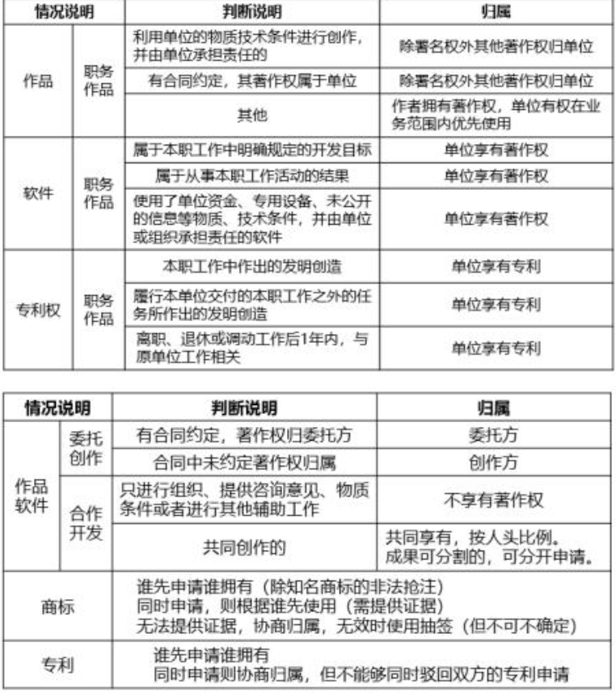
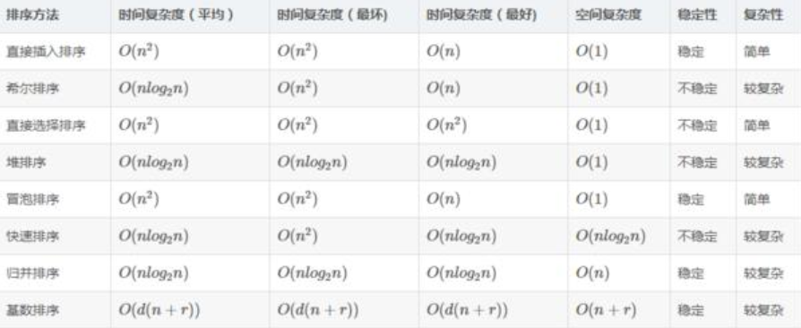

## 2019年下半年上午

- 非对称加密算法

	ECC、DSA、RSA
	
- 数字证书由CA签发给用户，CA保证它的安全和可靠性，使用CA的私钥对证书进行签名，使用CA的公钥验证签名的有效性。

- 著作权和软件权利

- 语法分析阶段的输入是 `记号流`

- IO系统的功能和层次模型

	- 隐藏物理设备细节
	- 与设备的无关性
	- 提高CPU和I/O设备利用率
	- 对I/O设备进行控制
	- 共享设备、系统有序执行

- 当进程请求磁盘时，操作系统先进行移臂调度，再进行旋转调度

- 敏捷开发方法scrum的步骤

	- product backlog
	- sprint backlog
	- sprint
	- release

- CMM是指软件过程能力成熟度模型，按照不同成熟度划分5个登记，其中1级被认为成熟度最低，5级最高。

- McCabe 复杂度 `V(G)=E-N+2 其中，E是流图中边的条数，N是结点数`

- E-R 图中的联系转换，多对多需要单独转换关系模式，也需要重新建类。

- [模式](../uml.md)

- 对于一个具有N个节点的图，可以使用n*n的矩阵来表示它们间的邻接关系。

- 算法时间复杂度

- ipv4 32位二进制表示，能够表示的地址空间 232 。 ipv6 128位二进制表示，能够表示的地址空间 2128